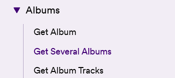
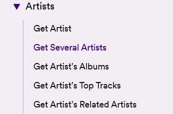

# Spotify_API_Testing

Documentatie: https://developer.spotify.com/documentation/web-api

## Descriere

Un proiect in care se testeaza mai multe endpoint-uri cu scenariile posibile.
In acest proiect ne ajutam de framework-ul de testare automata "Unittest" si libraria "Requests"<br>

 <br>


## Instalare dependinte

```bash
pip install -r requirements.txt
```


## Rulare
- clic buton rulare sau
- python -m unittest discover in terminal
